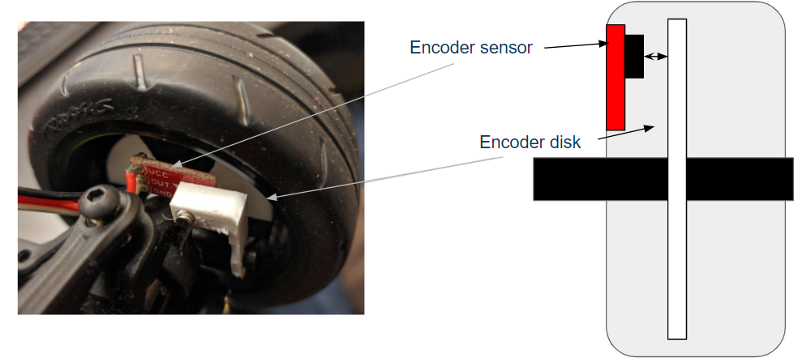

---
title: Design
layout: template
filename: design
order: 1
mathjax: true
--- 

# Design
We broke our goals down into several tasks we needed to perform:
 - Using computer vision to detect the lane markers and return the waypoints.
 - Using computer vision to detect the object and return the bounding boxs.
 - Implementing and MPC controller and control barrier functions(CBF) to follow the track and avoid obstacles.
 - Implementing a traction control algorithm to maximize vehicle traction and acceleration.

## Hardware Architecture

We started with the robot open autonomous racing (ROAR) platform for the Traxxas RC car. This included the NVIDIA Jetson Nano which was our central processing for the car. The Jetson Nano receives vision data from a RealSense D435i which was mounted on the front of the car and took in processed wheel speed data from an Arduino Nano which recieved data from the wheel encoders we designed. As vision and sensor data our coming in to the Jetson Nano it processes the optimal control and ultimately sends PWM commands to the original Traxxas electronic speed controller.

## Software Architecture

Our software relies on the wheel speeds from the wheel encoders and the image and depth data from the RealSense Camera. Our LQR Controller relies on waypoints generated by the vision algorithms, bounding boxes for obstacles, and wheel speeds. Given this information, it generates a MotorPWM and SteeringPWM. The MotorPWM is an input to the traction controller along with the wheel speeds to determine slip. The traction controller outputs a MotorPWM for the ESC and the previously generated SteeringPWM is given to the ESC to drive the motors.

## Setup

### Car

### Sensing
 - Used an Intel RealSense D435i RGB-D camera to estimate coordinates of desired waypoints to send to the controller
 - Custom designed wheel encoders used to independently estimate the velocity of all four wheels as well as the car's overall velocity

### Actuation
- After processing data on the Jetson Nano we send PWM commands to control:
  - The electronic speed controller for the drive motor
  - The servo motor for steering

## Lane Tracking

### Design Criteria
 - The lane tracking algorithm must generate three stable waypoints on the lane for the car to navigate.
 - The algorithm must be robust and in real time for the control algorithms.

### Main Challenges
 - Easy to be influenced by noisy pixels comes from other stuffs that have the similar color as our lane.
 - Hard to extract the outliers of lane based on the images with noises.
 - Waypoints might shift out of the lane which leads the race car run out of the track.
 - Image processing should be in real time.

### Method Design
 - We would use the filter based on HSV space to extract the line pixels from raw images.
 - We apply our waypoints getting algorithms based on the biggest connected component in order to remove the extra noises.
 - We have two methods to get the waypoints:
    - Extract the outlines of lane using Hough line detection based on edges generated by Canny edge detection, then get the middle line by averaging two lines. Finally get three way points in the line.
    - Fix three y cordinates, then average the x coordinates to get three way points.
 - We finally use a real sense API based on the camera parameters to translate the 2D waypoints into 3D which can be directly used by LQR controller.

## Object Detection

### Design Criteria
 - The object detection algorithm must be able to detect objects in front of the vehicle of any size.
 - Similar to the lane detection algorithm, it must be robust and run in real time to support the control algorithms.
 - It must also generate the 3D coordinates of each object it detects. 

### Design

There were originally two possible design choices, one using a trained neural net to detect objects, and a second that would use the depth data and perform image segmentation to determine objects in the image. We decided to use the second approach. This involved getting depth data from the RealSense camera and filtering the pixels based on the depth of each pixel. After performing filtering, the algorithm would need to determine bounding boxes for any remaining pixels and then filter those boxes to determine what objects actually exist.

### Tradeoffs/Design Choices

When deciding between the two options, there were a couple of tradeoffs to consider. With the neural net based approach, this would require gathering a large number of images and labelling the images so that the model could detect objects. The model would also determine more information than we needed, such as what type of object it found. Performing inference with this model would likely require more time and power, slowing down the speed of the control algorithms. However, this approach would likely be more robust in situations with different lighting and would have fewer false positives compared to the depth data/image segmentation approach.

The image segmentation approach was significantly more efficent than the neural net model in terms of both creating the algorithm and running the algorithm. We only needed a few images to test and tune our algorithm, and it ran fairly quickly since we used OpenCV which was optimized for speed. The tasks and filtering were also simplier to perform so it was more efficent. One tradeoff was the robustness of the algorithm, the depth data was prone to having patches of pixels with incorrect depths. For example, some patches of the ground were given a depth of 0.6 meters, while the rest of the ground had a depth of 0 meters. This caused some incorrect bounding boxes to be create, but additional tuning and filtering would remove most of those issues. Since speed was a significant criteria, and a majority of the tradeoffs could be managed, we decided the approach using depth data and image segmentation would be the best approach for object detection.

## Wheel Encoders

### Design Criteria

 - The encoders must be able to accurately and consistantly estimate the velocity of the four wheels independently
 - They must be designed so that an off-the-shelf Traxxis RC car can be retrofitted with them with as little modification as possible
 - The velocities of the wheels must be calculated on-board an Arduino Nano

### Design 

The wheel encoders were primarily designed to be rapidly prototyped and custom built using a 3D printer in-house. 4 digital line sensors were used as the basis for the encoder system. One line sensor was mounted on the suspension system near each wheel and pointed outward towards an encoder disk printed in white PLA, with alternating sections colored black to trigger the line sensor when the wheel is rotated. This signal is sent to an Arduino Nano mounted on a break-out board that registers these signals and uses the time between subsequent signals to measure the velocity of each wheel.  The values are then averaged to estiamte the overall body velocity of the car.  These values are then passed through a three-step, weighted moving average filter that smooths erroneous readings but still weighs the calculated value toward the latest estimate. Finally the four wheel velocities and the body velocity are sent to the Jetson Nano for use in the PID, LQR, and traction controllers.

### Main Challenges
The primary challenge in this part of the project was balancing the first two design criteria above. The encoders were originally designed with the line sensors' optimal measuring distance as 5mm. In practice, we observed the most consistant performance with a measuring distance of roughly 2 cm. This forced multiple redesigns of the encoder disks and made it very difficult to fit the disks, and wheels on the cars axles.

Another challenge was the relatively low precision 3D printer used to build the custom pieces. Often times pieces that were designed to a certain specification would have rough edges or imprecise angles, causing us to manually cut, file and force them into shape.

## Traction Control

### Motivation
High performance vehicles at both the full size and RC size scales are typically limited primarily by the total amount of frictional force that their tires can provide. This friction is needed to accelerate, brake, and turn, and much research has gone into figuring out how to increase the total amount of traction available. Under high speed cornering or sudden acceleration conditions, the amount of frictional force needed to maintain static friction between the ground and the tire can exceed what the tire is able to provide. When this occurs, the tire starts sliding instead of rolling (often referred to as "wheel slip") and vehicle traction and acceleration are both lost. Traction control algorithms are designed to detect when wheel slip occurs and modulate the throttle so that the vehicle can regain traction as quickly as possible.

### Existing Research
Research into existing traction control algorithms revealed an [IEEE paper](https://ieeexplore-ieee-org.libproxy.berkeley.edu/document/6402343) titled *Model Predictive PID Traction Control Systems for Electric Vehicles* published by Tohru Kawabe. In this paper, Kawabe quantifies wheel slip using the slip ratio $\lambda$ defined as

$$ \frac{V_{\omega}V}{V_\omega} $$

where $V_{\omega}$ is the wheel velocity and $V$ is the vehicle body velocity. Physically, a slip ratio of 0 corresponds to wheel velocity exactly matching body velocity. A positive slip ratio corresponds to wheel velocity exceeding body velocity, such as traction loss during acceleration from a stand still when the torque sent to the tire exceeds the frictional force available. A negative slip ratio corresponds to body velocity exceeding wheel velocity, such as traction loss during high speed cornering when the tire is no longer able to continue rolling and begins sliding.
The exact relationship between slip ratio and the amount of frictional force that the tire can provide is related through a formula called the Magic-Formula developed through testing data:

$$ \mu(\lambda)=-c_{road}\times 1.1\times(e^{-35\lambda}-e^{-0.35\lambda}) $$

where $\mu$ is the coefficient of friction and $c_{road}$ is a parameter that depends on the condition of the road being driven on.
Plotting this equation yields the following graph:

which indicates that in general, $\mu$ is maximized at a slip ratio of $\lambda=0.1$. This therefore drove the design of our traction controller to limit wheel slip ratio to a range of 0.05 to 0.15 with a desired slip ratio of 0.1.
