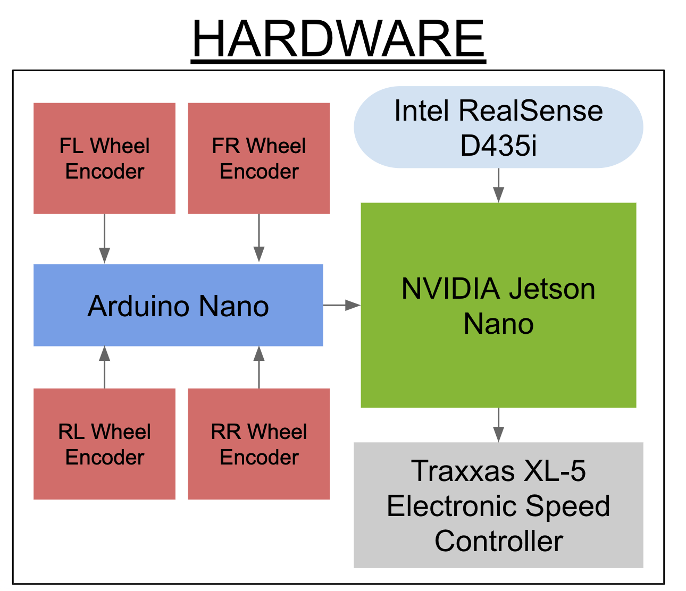
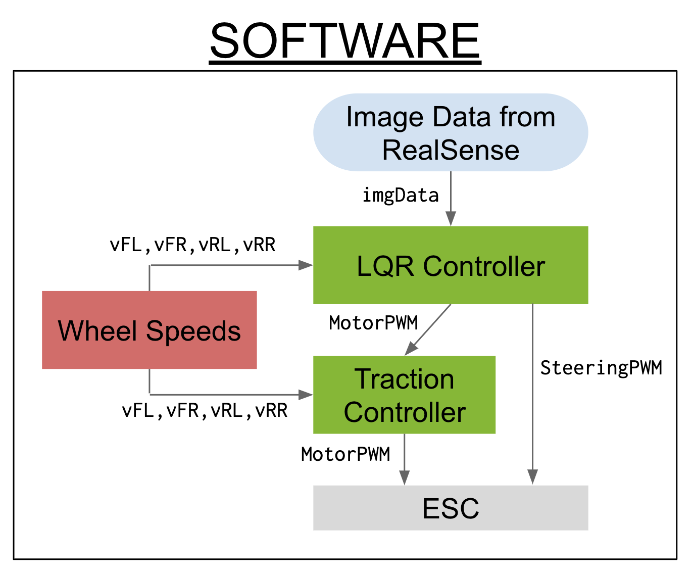
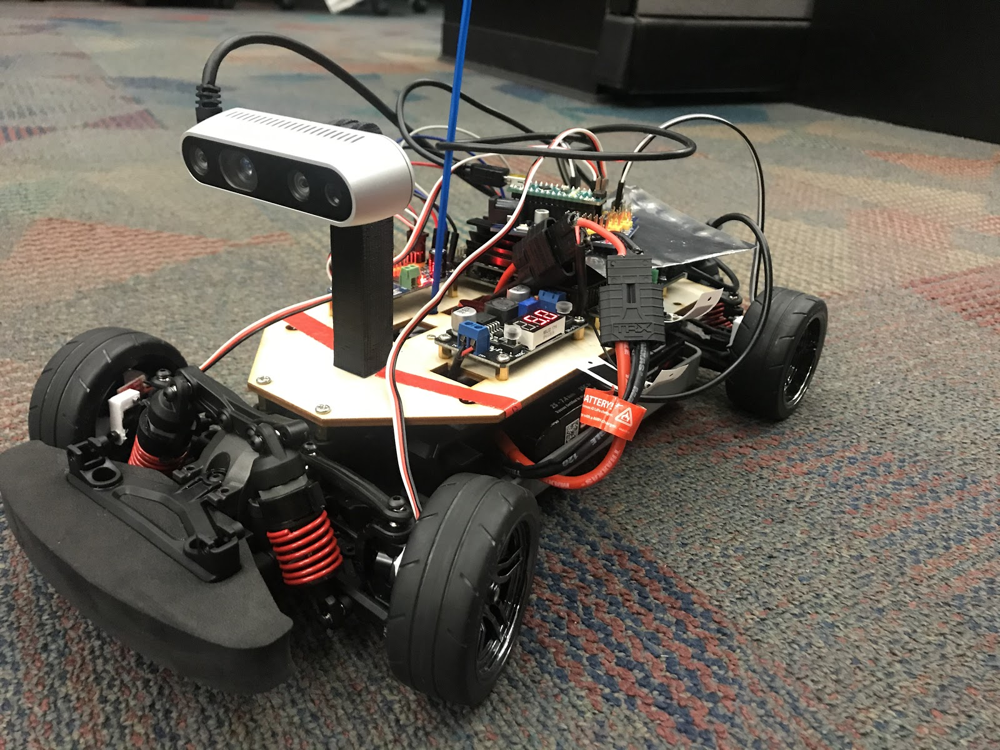
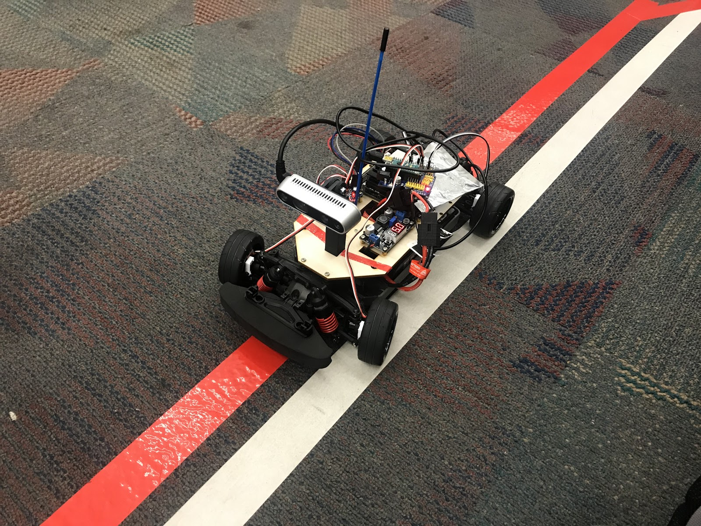
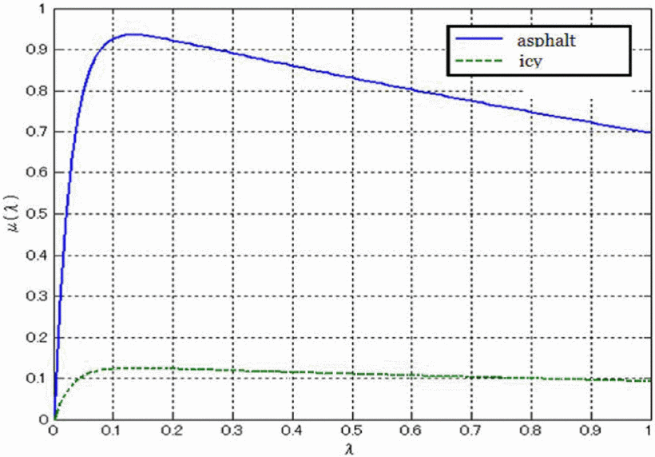

---
title: Design
layout: template
filename: design
order: 1
--- 

# Design
We broke our goals down into several tasks we needed to perform:
 - Using computer vision to detect the lane markers and return the waypoints.
 - Using computer vision to detect the object and return the bounding boxs.
 - Implementing and MPC controller and control barrier functions(CBF) to follow the track and avoid obstacles.
 - Implementing a traction control algorithm to maximize vehicle traction and acceleration.

## Hardware Architecture

## Software Architecture

## Setup

## Lane Tracking

### Design Criteria
 - The lane tracking algorithm must generate three stable waypoints on the lane for the car to navigate.
 - The algorithm must be robust and in real time for the control algorithms.

### Main Challenges
 - Easy to be influenced by noisy pixels comes from other stuffs that have the similar color as our lane.
 - Hard to extract the outliers of lane based on the images with noises.
 - Waypoints might shift out of the lane which leads the race car run out of the track.
 - Image processing should be in real time.

### Method Design
 - We would use the filter based on HSV space to extract the line pixels from raw images.
 - We apply our waypoints getting algorithms based on the biggest connected component in order to remove the extra noises.
 - We have two methods to get the waypoints:
    - Extract the outlines of lane using Hough line detection based on edges generated by Canny edge detection, then get the middle line by averaging two lines. Finally get three way points in the line.
    - Fix three y cordinates, then average the x coordinates to get three way points.
 - We finally use a real sense API based on the camera parameters to translate the 2D waypoints into 3D which can be directly used by LQR controller.

## Traction Control

### Motivation
High performance vehicles at both the full size and RC size scales are typically limited primarily by the total amount of frictional force that their tires can provide. This friction is needed to accelerate, brake, and turn, and much research has gone into figuring out how to increase the total amount of traction available. Under high speed cornering or sudden acceleration conditions, the amount of frictional force needed to maintain static friction between the ground and the tire can exceed what the tire is able to provide. When this occurs, the tire starts sliding instead of rolling (often referred to as "wheel slip") and vehicle traction and acceleration are both lost. Traction control algorithms are designed to detect when wheel slip occurs and modulate the throttle so that the vehicle can regain traction as quickly as possible.

### Existing Research
Research into existing traction control algorithms revealed an [IEEE paper](https://ieeexplore-ieee-org.libproxy.berkeley.edu/document/6402343) titled *Model Predictive PID Traction Control Systems for Electric Vehicles* published by Tohru Kawabe. In this paper, Kawabe quantifies wheel slip using the slip ratio $\lambda$ defined as

$$ \frac{V_{\omega}V}{V_\omega} $$

where $V_{\omega}$ is the wheel velocity and $V$ is the vehicle body velocity. Physically, a slip ratio of 0 corresponds to wheel velocity exactly matching body velocity. A positive slip ratio corresponds to wheel velocity exceeding body velocity, such as traction loss during acceleration from a stand still when the torque sent to the tire exceeds the frictional force available. A negative slip ratio corresponds to body velocity exceeding wheel velocity, such as traction loss during high speed cornering when the tire is no longer able to continue rolling and begins sliding.
The exact relationship between slip ratio and the amount of frictional force that the tire can provide is related through a formula called the Magic-Formula developed through testing data:

$$ \mu(\lambda)=-c_{road}\times 1.1\times(e^{-35\lambda}-e^{-0.35\lambda}) $$

where $\mu$ is the coefficient of friction and $c_{road}$ is a parameter that depends on the condition of the road being driven on.
Plotting this equation yields the following graph:

which indicates that in general, $\mu$ is maximized at a slip ratio of $\lambda=0.1$. This therefore drove the design of our traction controller to limit wheel slip ratio to a range of 0.05 to 0.15 with a desired slip ratio of 0.1.
