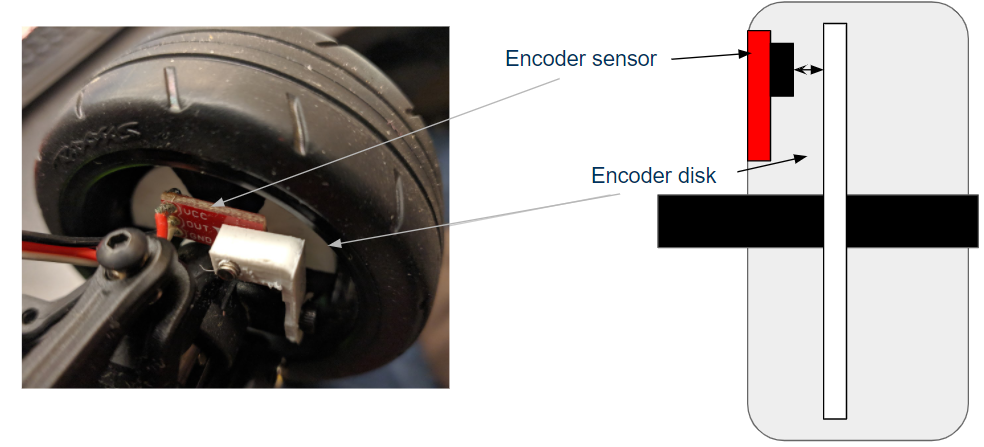

---
title: Implementation
layout: template
filename: implementation
order: 2
mathjax: true
--- 

# Implementation

## Hardware
 - Traxxas RC car
 - Jetson Nano computer w/ Ubuntu 18.04
 - Intel RealSense D435i RGB-D camera
 - Arduino Nano with breakout board
 - SparkFun QRE1113 Line Sensor
 - Dremel D45 3D printer
 - Custom encoder mounts and disks

 

## Software
The software for this project was written using Python on a Linux machine.
### Lane Tracking
- Input: Video stream
- Get 2D way points:
  - 1st method
    - Using filter function from OpenCV to extract the red(color of the lane) region from the raw image based on  HSV space
    - Extracting Edge by Canny edge detection.
    - Using Hough line detection algorithm to get two straight outlines of the lane.
    - Averaging over the two lines to get the middle line.
    - Selecting three 2D way points on the line.
    

   &rarr;
    &rarr;
  
  
  - 2nd method
    - Using filter function from OpenCV to extract the red(color of the lane) region from the raw image based on  HSV space.
    - Removing noisy pixels by finding the biggest connected component based on connected component labeling.
    - Collect all the pixels in the biggest connected component.
    - Selecting three fixed y coordinates.
    - Averaging over the x coordinates with the same fixed y coordinates to get the 2D way points.
    
    

    &rarr;
    &rarr;
  

 - Using RealSense API to transform the 2D coordinates into 3D
 - Output: Three 3D waypoints
  

### Obstacle Detection
- Input: Depth data from a RealSense camera at 30 FPS.
- Approach
	- Filter depth data to only keep pixels with a certain depth. 
	- Determine depth of ground/red lane line. 
	- Keep all pixels that have a depth greater than the depth of the ground and less than 3 meters. 
		- This removes some extraneous points due to the carpet
	- Use OpenCV to create contours and bounding boxes for all remaining pixel groups
	- Filter the remaining bounding boxes by object position, size, distance, and object height
		- Filtering by object size and height helps remove some incorrect bounding boxes caused by incorrect depth data.

    

    &rarr;
    &rarr;
  

- Generate 3D location of objects using the RealSense API to convert pixel coordinates and depth to a 3D coordinate
- Output: List of centers of obstacles detected

### Controllers

#### SMART PID
A "Smart" PID controller was intially created to test the car's vision algorithm. It enforced a constant straightline velocity and attempted to control the relative x position of the middle way point. The car would try to keep its body in line with our track by steering to correct any deviations from the track's x position to the car's own x position. The "smart" aspect was the fact that the controller also calulated the upcoming radius of turns. The controller reduced the commanded moter PWM propertially to decreasing turn radii. By slowing down for turns the vision algorithm would have more time recalculate accurate changes for steering commands. This made the car much more successful at completing turns.

The "Smart" PID controller was used in testing and degubbing the vision algoithm for its simplicity. With only a proportional gain, we would be able to isolate issues with the vision whether it was latency or finding incorrect way points. The PID controller was the fastest possible controller so any latency issues came down to the image processing. We would know when incorrect way points were being picked up because the controller was easily understood. 

#### MPC with LQR

In order to get quick optimal commands from our computer vision determined state estimates, we decided on a Linear Quadradic Regulator or LQR controller to implement our optimal state based control. A simplified bicycle model is most simple but accurate representation of our vehicle. Its states consist of: a relative x coorinate (longitudinal), a relative y coordinates (lateral), and an inertial heading with respect to the track. The closest waypoint is used to get our relative x and y coordinates and the inertial heading is determined from a reference radius which is calculated from our 3 waypoints. The controller's inputs are the steering angle and velocity of the car, which exactly match our two actuation parameters. The simplified bicycle model was linearized, controller gains were determined in Simulink, and the controller was ultimatly implemented using controlpy a python toolbox that can solve the Riccati equation.

The LQR optimization was performed repeatedly for every control step giving us a Model Predictive Control (MPC) scheme. However, this had to be heavily modified in order to add the additional constraint required to implement the safety feautures we planned. Initally, the optimal controller was calculated via the Ricatti equation, but this was no longer possible with the aforementioned constraint, so we adopted a different approach:
 - Inputs were chosen as the waypoints generated by the lane keeping algorithm 
 - Outputs were the steering angle and velocity required to achieve the desired location
 - Create a linear estimate of the system dynamics based on a simplified bicycle model
 - For each control step, take the standard LQR form and convert it to a Convex Quadratic Program (CQP, as below)
 
 
 
 - Solve the CQP for a finite number of time steps
 -repeat linearization, reformulation of LQR and and solution of CQP until system is stopped.

### Traction Control

In order to maintain a slip ratio of 0.1, a simple proportional controller was implemented. The error term was calculated as the difference between the measured slip ratio using the wheel encoders and the desired slip ratio of 0.1. This was multiplied by a gain $K_p$, and then added to the desired velocity to produce the modified velocity input in the form of a MotorPWM to send to the car's ESC.

The traction controller was tested by sending a large, constant MotorPWM value to the ESC and measuring the resulting slip ratio at each of the wheels. These values were also written to a CSV file for post processing.

## Complete System Overview
1. Data from the wheel encoders are passed to the Arduino Nano, which calculates the velocities of each wheel. That data is passed to the Jetson Nano. RealSense camera data is also passed into the Jetson Nano.
2. Given this data, the LQR controller determines the correct MotorPWM and SteeringPWM to keep the car moving along the red lane line and detecting obstacles.
	- This involves the obstacle detection and lane detection algorithms taking in depth and camera data.
3. The MotorPWM is passed to the Traction Controller module to prevent the MotorPWM from causing slip.
4. The SteertingPWM and MotorPWM is passed to the Traxxas XL-5 electronic speed controller (ESC) to control all the motors.
