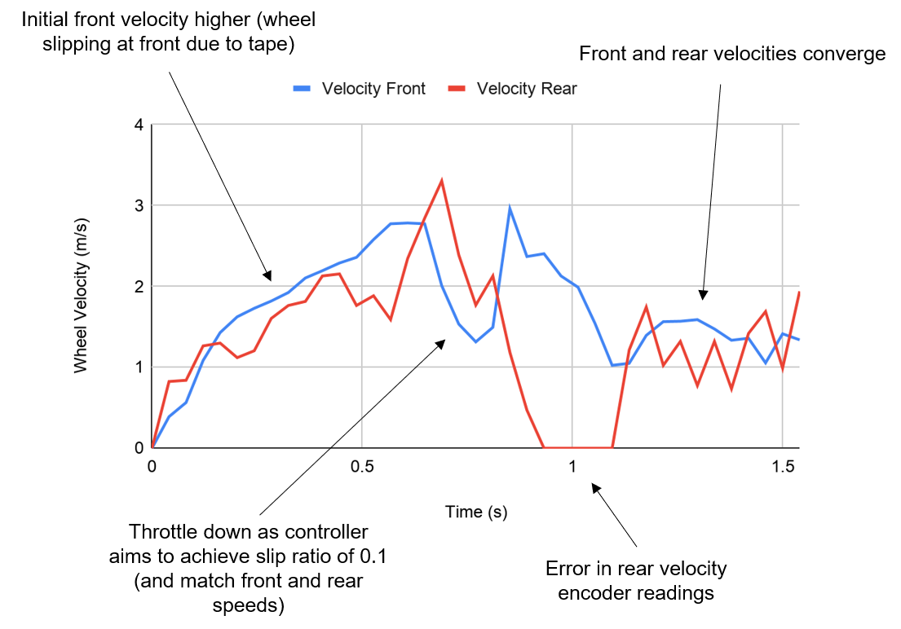

---
title: Results
layout: template
filename: results
order: 3
mathjax: true
--- 

# Results

Our vehicle is able to successfully follow a red lane line and perform close to 90 degree turns at a moderate speed. It is also able to detect obstacles in its path and determine the location of each obstacle. On low friction surfaces, the traction controller prevents the vehicle from slipping, allowing the car to continue at a higher speed on slippery surfaces. 

## Line Following




## Obstacle Detection


### Control Barrier Function


## Traction Control

### Example of wheel slip



### Test Data

Wheel speeds from each wheel of the car were recorded to observe the effect of our traction controller. The velocities of the front wheels were averaged to yield the front axle velocity, and the same with the rear to yield the rear axle velocity. In an ideal case with no slip the rear and front velocities should match. By applying tape to the front tires of the car to reduce their friction we expect the front tires to lose traction and spin freely compared to the rears, which should appear in the data as the front velocity consistently being greater than the rear.

This sample of data from one of our test runs with traction control enabled shows this behavior initially, with front velocity higher than the rear velocity. But with the traction controller limiting the motor power, we see a dip in the velocity of both axles as the controller throttles down the power to attempt to reach a slip ratio of 0.1. Once this is obtained, the velocities both increase again but now stay around the same value, indicating that the controller is effective in reducing wheel slip.

## Autonomous Driving


